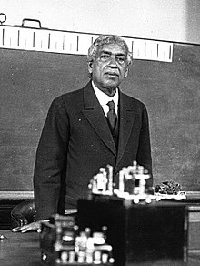

<table class="infobox biography vcard">
<tbody>
<tr>
<th colspan="2">

<a title="Acharya" href="https://en.wikipedia.org/wiki/Acharya">Acharya</a>,&nbsp;<strong>Sir</strong>

 

Jagadish Chandra Bose

 

<strong><small><a title="Knight Bachelor" href="https://en.wikipedia.org/wiki/Knight_Bachelor">Kt</a>,</small></strong><small>&nbsp;<a title="Order of the Star of India" href="https://en.wikipedia.org/wiki/Order_of_the_Star_of_India">CSI</a>,&nbsp;<a title="Order of the Indian Empire" href="https://en.wikipedia.org/wiki/Order_of_the_Indian_Empire">CIE</a>,&nbsp;<a title="Fellow of the Royal Society" href="https://en.wikipedia.org/wiki/Fellow_of_the_Royal_Society">FRS</a></small>

</th>
</tr>
<tr>
<td colspan="2">

Bose lecturing on the "nervous system" of plants at the Sorbonne in Paris in 1926

</td>
</tr>
<tr>
<th scope="row">Born</th>
<td>30 November 1858 

<a title="Mymensingh" href="https://en.wikipedia.org/wiki/Mymensingh">Mymensingh</a>,&nbsp;<a title="Bengal Presidency" href="https://en.wikipedia.org/wiki/Bengal_Presidency">Bengal Presidency</a>,&nbsp;<a class="mw-redirect" title="British India" href="https://en.wikipedia.org/wiki/British_India">British India</a>&nbsp;(now in Bangladesh)

</td>
</tr>
<tr>
<th scope="row">Died</th>
<td>23 November 1937&nbsp;(aged&nbsp;78) 

<a title="Giridih" href="https://en.wikipedia.org/wiki/Giridih">Giridih</a>, Bengal Presidency, British India (now Giridih,&nbsp;<a title="Jharkhand" href="https://en.wikipedia.org/wiki/Jharkhand">Jharkhand</a>, India)

</td>
</tr>
<tr>
<th scope="row">Alma&nbsp;mater</th>
<td><a class="mw-redirect" title="St. Xavier's College, Calcutta" href="https://en.wikipedia.org/wiki/St._Xavier%27s_College,_Calcutta">St. Xavier's College, Calcutta</a>&nbsp;(<a class="mw-redirect" title="B.A." href="https://en.wikipedia.org/wiki/B.A.">B.A.</a>) <a title="Christ's College, Cambridge" href="https://en.wikipedia.org/wiki/Christ%27s_College,_Cambridge">Christ's College, Cambridge</a>&nbsp;(B.A.) <a title="University College London" href="https://en.wikipedia.org/wiki/University_College_London">University College London</a>&nbsp;(<a class="mw-redirect" title="B.Sc." href="https://en.wikipedia.org/wiki/B.Sc.">B.Sc.</a>,&nbsp;<a class="mw-redirect" title="D.Sc." href="https://en.wikipedia.org/wiki/D.Sc.">D.Sc.</a>)</td>
</tr>
<tr>
<th scope="row">Known&nbsp;for</th>
<td><a title="Extremely high frequency" href="https://en.wikipedia.org/wiki/Extremely_high_frequency">Millimetre waves</a> <a title="Radio" href="https://en.wikipedia.org/wiki/Radio">Radio</a> <a title="Crescograph" href="https://en.wikipedia.org/wiki/Crescograph">Crescograph</a> Contributions to&nbsp;<a class="mw-redirect" title="Plant biology" href="https://en.wikipedia.org/wiki/Plant_biology">plant biology</a> <a title="Crystal radio" href="https://en.wikipedia.org/wiki/Crystal_radio">Crystal radio</a> <a title="Crystal detector" href="https://en.wikipedia.org/wiki/Crystal_detector">Crystal detector</a></td>
</tr>
<tr>
<th scope="row">Spouse(s)</th>
<td><a title="Abala Bose" href="https://en.wikipedia.org/wiki/Abala_Bose">Abala Bose</a></td>
</tr>
<tr>
<th scope="row">Awards</th>
<td><a title="Order of the Indian Empire" href="https://en.wikipedia.org/wiki/Order_of_the_Indian_Empire">Companion of the Order of the Indian Empire</a>&nbsp;(CIE) (1903) <a title="Order of the Star of India" href="https://en.wikipedia.org/wiki/Order_of_the_Star_of_India">Companion of the Order of the Star of India</a>&nbsp;(CSI) (1911) <a title="Knight Bachelor" href="https://en.wikipedia.org/wiki/Knight_Bachelor">Knight Bachelor</a>&nbsp;(1917)</td>
</tr>
<tr>
<td colspan="2">Scientific career</td>
</tr>
<tr>
<th scope="row">Fields</th>
<td class="category"><a title="Physics" href="https://en.wikipedia.org/wiki/Physics">Physics</a>,&nbsp;<a title="Biophysics" href="https://en.wikipedia.org/wiki/Biophysics">biophysics</a>,&nbsp;<a title="Biology" href="https://en.wikipedia.org/wiki/Biology">biology</a>,&nbsp;<a title="Botany" href="https://en.wikipedia.org/wiki/Botany">botany</a>,&nbsp;<a title="Bengali literature" href="https://en.wikipedia.org/wiki/Bengali_literature">Bengali literature</a>,&nbsp;<a title="Bengali science fiction" href="https://en.wikipedia.org/wiki/Bengali_science_fiction">Bengali science fiction</a></td>
</tr>
<tr>
<th scope="row">Institutions</th>
<td><a title="Rajabazar Science College" href="https://en.wikipedia.org/wiki/Rajabazar_Science_College">Rajabazar Science College</a> <a title="University of Calcutta" href="https://en.wikipedia.org/wiki/University_of_Calcutta">University of Calcutta</a> <a title="University of Cambridge" href="https://en.wikipedia.org/wiki/University_of_Cambridge">University of Cambridge</a> <a title="University of London" href="https://en.wikipedia.org/wiki/University_of_London">University of London</a></td>
</tr>
<tr>
<th scope="row">Academic advisors</th>
<td><a class="mw-redirect" title="John Strutt, 3rd Baron Rayleigh" href="https://en.wikipedia.org/wiki/John_Strutt,_3rd_Baron_Rayleigh">John Strutt (Rayleigh)</a></td>
</tr>
<tr>
<th scope="row">Notable students</th>
<td><a title="Satyendra Nath Bose" href="https://en.wikipedia.org/wiki/Satyendra_Nath_Bose">Satyendra Nath Bose</a> <a title="Meghnad Saha" href="https://en.wikipedia.org/wiki/Meghnad_Saha">Meghnad Saha</a> <a title="Prasanta Chandra Mahalanobis" href="https://en.wikipedia.org/wiki/Prasanta_Chandra_Mahalanobis">Prasanta Chandra Mahalanobis</a> <a title="Sisir Kumar Mitra" href="https://en.wikipedia.org/wiki/Sisir_Kumar_Mitra">Sisir Kumar Mitra</a> <a title="Debendra Mohan Bose" href="https://en.wikipedia.org/wiki/Debendra_Mohan_Bose">Debendra Mohan Bose</a></td>
</tr>
<tr>
<th colspan="2">Signature</th>
</tr>
<tr>
<td colspan="2"></td>
</tr>
</tbody>
</table>
 

 

<h2>Publications </h2>

<ul>

                             

 <li><a target="_blank" href="https://github.com/manjunath5496/Jagadish-Chandra-Bose-Publications/blob/master/jdish(1).pdf" style="text-decoration:none;">The Action of Drugs on Plants</a></li>

 <li><a target="_blank" href="https://github.com/manjunath5496/Jagadish-Chandra-Bose-Publications/blob/master/jdish(2).pdf" style="text-decoration:none;">Circulation and Assimilation in Plants</a></li>

<li><a target="_blank" href="https://github.com/manjunath5496/Jagadish-Chandra-Bose-Publications/blob/master/jdish(3).pdf" style="text-decoration:none;">Plant and Animal Response</a></li>

 </ul>
